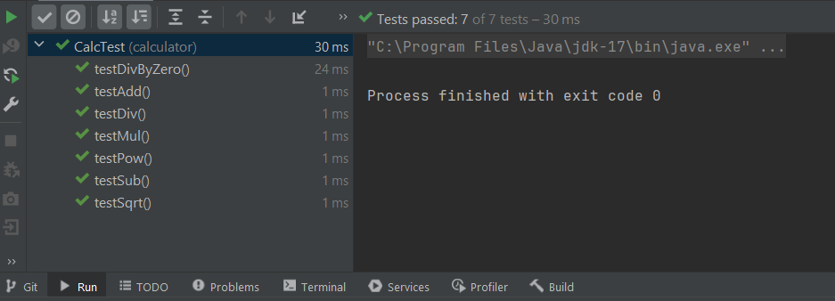

# Testes de Software
Os teste de software são uma etapa muito importante do desenvolvimento de qualquer aplicação.
Muitas vezes acabam por ser deixados de lados, diminuindo assim sua real importância.
Podemos dividir os testes em 3 grandes categorias:

### Testes Unitários
Testa uma única classe ou método. Esses testes são feitos isoladamente.

### Testes de Integração
Testa o funcionamento do conjunto de classes e métodos como um todo. Testa a colaboração e a combinação de várias classes e seus métodos, como conjunto.

### Teste Funcional
Testes desenvolvidos sob a ótica do usuário. São feitos já no "front" ou outra interface adotada.

Os testes são similares, entre em si, mudando somente o escopo onde são efetuados.

## JUnit

As classes de teste, não tem nada de especial em relação a uma classe normal em Java. O que mudam são algumas anotações e métodos que o JUnit nos fornece para nos auxiliar no escopo de testes.
Por exemplo, se pensarmos em uma classe Calculadora, basta criarmos uma classe TesteCalc e escrevermos seus respecitvos testes.

Primeiramente, é necessário adiocionar a dependência do Junit em nosso projeto.
```xml
 <dependencies>
        <dependency>
            <groupId>org.junit.jupiter</groupId>
            <artifactId>junit-jupiter</artifactId>
            <version>RELEASE</version>
            <scope>test</scope>
        </dependency>
    </dependencies>
```

### Um método de teste utilizando o JUnit, precisa ser anotado com @Test.
Ex.
```java
public class TesteCalc{
@Test
  public void testeSoma(){
  ...
  }
```

### O método de teste, deve explorar a funcionalidade a ser testada.

```java
public class TesteCalc{
  @Test
  public void TesteSoma(){
    Calc c = new Calc();
    int i = c.add(3,2);
  }
}
```
Outra coisa que temos que ter mente, é que precisamos criar o cenário, que será necessário para efetuar o teste da funcionalidade desejada.
Alguns exemeplos, são criar um novo banco de dados, com os registros necessários para efetuar um determinado teste. Criar um arquivo de configuração necessário para explorarmos uma determinada funcionalidade e testa-lá.
No nosso caso, nosso cenário basicamente é a criação de uma nova instância de nossa calculadora.

E finalmente, após criarmos nossa classe de testes, anotar o método de teste, e criarmos o cenário para nosso teste, precisamos verificar o resultado da execução de nosso teste.

```java
public class TesteCalc{
  @Test
  public void TesteSoma(){
    Calc c = new Calc();
    int i = c.add(3,2);
    assertEquals(5,i);
  }
}
```
O método assetEquals é um dos métodos mais utilizados do JUnit, porém existem vários outros:

* assertTrue( );
  - Verifica se uma determinada condição é verdadeira.
  
* assertFalse( );
  - Verificada se uma determinada condição é falsa.
  
* assertEquals( );
  - Verifica se uma determinada condição é igual.
  
* assertNotEquals( );
  - Verifica se uma determinada condição não é igual.
  
* assertSame( );
  - Verifica se as instâncias de um determinado objeto é o mesmo, ou melhor se as instâncias testadas são as mesmas.
  
* assertNotSame( );
  - Verifica se as instâncias não são as mesmas, ou melhor se as instâncias dos objetos testados são diferentes.
  
* assertNull( );
  - Verifica se a condição testada retorna uma valor Null.
  
* assertNotNull( );
  - Verifica se a condição testada não é Null.
  
* fail( );
  - Faz um teste falhar.

  Outras anotações importantes são mais relacionadas a criação de cenários para teste de software.

  *@BeforeAll*
  
  Está anotação indica ao Junit, que o método anotado, deve ser executado antes de todos os testes terem sido executados.
  O método anotado para ser executado antes de todos os outros, deverá ser estático (static).
  
  *@AfterAll*
  
  Está anotação indica ao Junit, que o método anotado, deve ser executado após todos os testes terem sido executados.
  O método anotado para ser executado depois de todos os outros, deverá ser estático (static).

  *@BeforeEach*
  
  Está anotação indica ao Junit, que o método anotado, deve ser executado antes da execução de cada uma dos testes.

  *@AfterEach*
  
  Está anotação indica ao Junit, que o método anotado, deve ser executado depois da execução de cada uma dos testes.

Existem mais testes, a lista completa pode ser obtida da documentação do Junit;


Exemplo de classe de testes:
```java
package calculator;

import org.junit.jupiter.api.*;

import static org.junit.jupiter.api.Assertions.assertEquals;
import static org.junit.jupiter.api.Assertions.assertThrows;

class CalcTest {
    double a;
    double b;
    double res;
    Calc calc;

    @BeforeAll
    static void setUpBeforeClass() throws Exception {

    }
    @AfterAll
    static void tearDownAfterClass() throws Exception {

    }

    @BeforeEach
    void setUp() {
        calc = new Calc();
        a = 5;
        b = 2;
        res = 0;
    }

    @AfterEach
    void tearDown() {
        calc = null;
    }

    @Test
    void testAdd() {
        res = calc.add(a, b);
        assertEquals(7, res);
    }

    @Test
    void testSub() {
        res = calc.sub(a, b);
        assertEquals(3, res);
    }

    @Test
    void testMul() {
        res = calc.mul(a, b);
        assertEquals(10, res);
    }

    @Test
    void testDiv() {
        res = calc.div(a, b);
        assertEquals(2.5, res);
    }

    @Test
    void testDivByZero() {
        b = 0;
        Exception exception = assertThrows(ArithmeticException.class, () -> calc.div(a, b));
        String message = exception.getMessage();
        String expected = "Division by zero";
        assertEquals(expected, message);
    }

    @Test
    void testPow() {
        res = calc.pow(a, b);
        assertEquals(25, res);
    }
    
    @Test
    void testSqrt() {
        a = 4;
        res = calc.sqrt(a);
        assertEquals(2, res);
    }
}
```

[Documentação Junit](https://junit.org/junit5/docs/5.0.1/api/org/junit/jupiter/api/Assertions.html)
